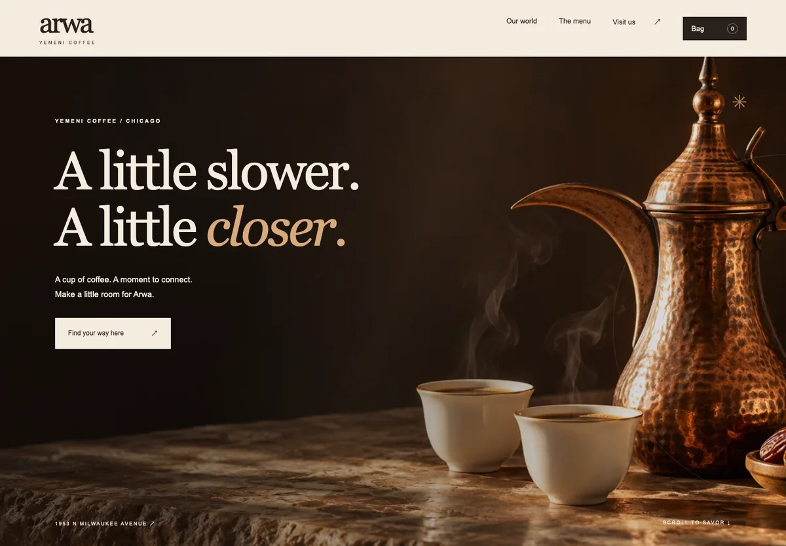
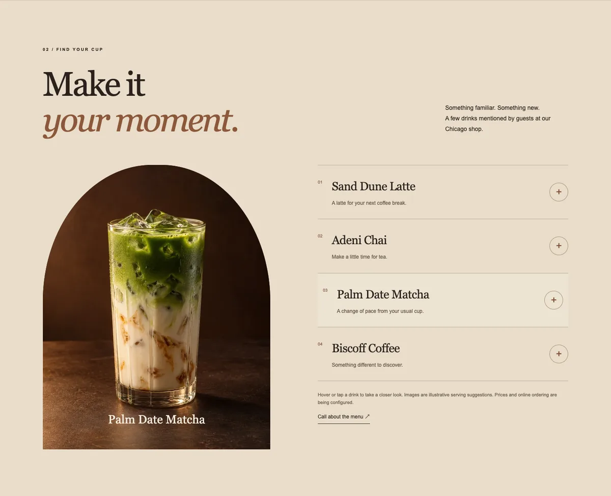
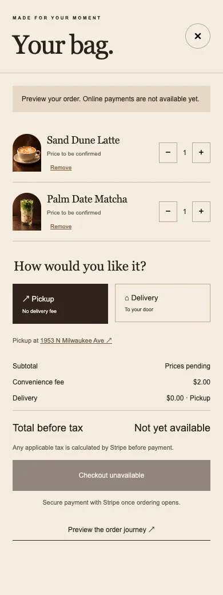
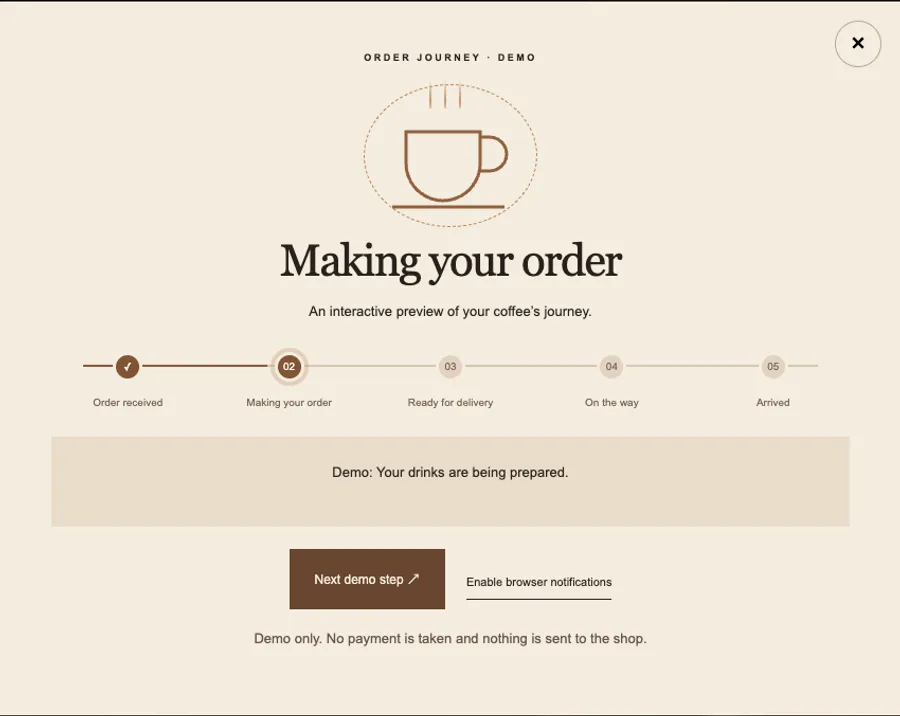
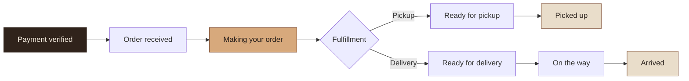
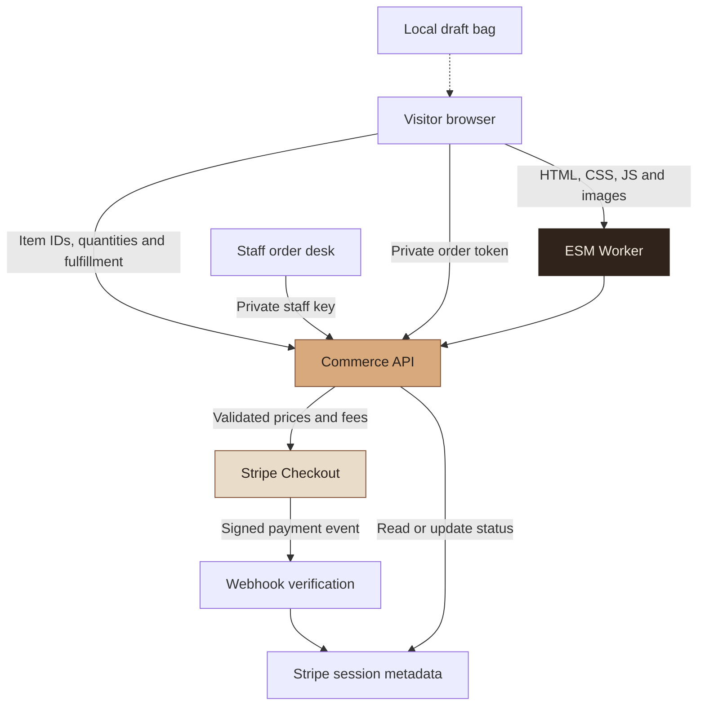

<div align="center">

# Arwa Yemeni Coffee

### A little slower. A little closer.

An atmospheric coffeehouse website for Chicago—with a thoughtful menu experience,<br>
a mobile shopping bag, and an order journey designed around the next good cup.

[](https://nodejs.org/)


[Explore the site](https://arwa-yemeni-coffee-chicago.shaqib-dev.chatgpt.site/) · [Get started](#get-started) · [Ordering setup](ORDERING-SETUP.md) · [Source notes](SOURCES.md)



</div>

> [!IMPORTANT]
> **The website is built; live ordering is not activated.** The hosted site currently requires owner access. The cart and tracker demo work without credentials, but real payments need approved prices, delivery settings, Stripe configuration, and a staffed fulfillment process. Unknown prices are shown as pending. No real payment was made during implementation.

## At a glance

A one-page brand experience with an intentionally small stack: **HTML, CSS, vanilla JavaScript, and a server-side ESM Worker**. There are no package dependencies to install and no frontend framework to learn.

| For visitors | For the business | For developers |
| --- | --- | --- |
| Explore drinks with hover, focus, or tap | Keep fees separate and visible | Run locally with one command |
| Build a bag for pickup or delivery | Configure prices on the server | Build without a bundler |
| Preview the order journey | Advance paid orders from a staff desk | Test commerce logic with Node’s test runner |
| Find hours, phone, and directions | Preserve verified business details | Deploy a Worker with embedded assets |

**Jump to:** [The experience](#the-experience) · [Get started](#get-started) · [How ordering works](#how-ordering-works) · [Architecture](#architecture) · [Configuration](#configuration) · [Project structure](#project-structure) · [Testing](#testing) · [Deployment](#deployment) · [Troubleshooting](#troubleshooting)

## The experience

### Coffee, with a closer look

Four drink previews share the site’s espresso, parchment, and copper palette. Hover or keyboard-focus a drink on desktop to reveal its image; tap its name on mobile to expand the preview. The original hero artwork stays intact.



The artwork is **illustrative serving imagery**, not verified photography of the shop’s actual drinks. The menu labels, contact details, hours, and quoted review excerpts have separate factual provenance in [SOURCES.md](SOURCES.md).

### A bag that feels at home on a phone

<table>
<tr>
<td width="36%" valign="top">

</td>
<td width="64%" valign="top">

#### Small details, clear decisions

- **Quantity controls** and removal for each drink.
- **Device-local draft persistence** so the bag survives a refresh.
- **Pickup or delivery**, with address fields for delivery.
- **A $2 convenience fee** once per nonempty order.
- **No delivery fee for pickup.** Delivery uses the configured fee.
- **Visible pending states** when business prices or delivery settings are missing.
- **Stripe-hosted payment**, once configured; card details are entered on Stripe.

A draft bag is not a submitted order. The server recalculates the amount before creating a Checkout Session.

</td>
</tr>
</table>

### A journey you can follow



The tracker has clickable stage explanations, a clearly labeled demo, and a distinct pickup journey. For real orders, the server verifies payment and retrieves staff-updated status from Stripe. Progress is never advanced by a timer.

**Also included:**

- Three-depth transform-based hero parallax, a light sweep, subtle reveals, and a pause control.
- Reduced-motion support, keyboard focus styles, semantic headings, and modal dialogs.
- About, menu, review, hours, location, and contact sections.
- Tap-to-call phone links and Google Maps directions.
- Page metadata, a custom favicon, social image, sitemap, and local-business structured data.
- On-page confirmations and optional browser notifications while the page remains open.

## Get started

### 1. Clone the project

Install **Node.js 22 or newer** and Git, then run:

```sh
git clone https://github.com/Skeeb32/Arwa-Yemeni-Coffee.git
cd Arwa-Yemeni-Coffee
```

There is no dependency installation step. The npm scripts use Node’s built-in APIs.

### 2. Start the local preview

```sh
npm run dev
```

Open **[http://127.0.0.1:4187](http://127.0.0.1:4187)**. Use this exact local origin when testing checkout: the development server normalizes API requests to it.

The default experience needs **no Stripe credentials**. It intentionally leaves payment disabled so you can explore the design, bag, pickup/delivery controls, and tracker demo.

### 3. Try the visitor flow

1. Scroll to the menu and hover or tap a drink name.
2. Press **+** to add a drink, then open **Bag** in the navigation.
3. Adjust quantities and switch between pickup and delivery.
4. Check that pickup shows a $0.00 delivery charge.
5. Choose **Preview the order journey** and step through the demo.
6. Enable your operating system’s reduced-motion preference to see the static alternative.

### Everyday commands

| Command | What it does |
| --- | --- |
| `npm run dev` | Serves `public/` and local API routes at `127.0.0.1:4187` |
| `npm test` | Runs the commerce tests without contacting Stripe |
| `npm run build` | Recreates `dist/` and emits the deployable Worker |

Frontend changes appear after refreshing the page. Restart the development server after editing server modules. Stop it with **Ctrl+C**.

## How ordering works

### The total

```text
Items subtotal
+ $2.00 convenience fee
+ configured delivery fee  ← $0.00 for pickup
+ applicable tax           ← calculated by Stripe before payment
─────────────────────────
Final amount
```

Prices are configured in **integer USD cents** on the server. The client sends item IDs and quantities—not an authoritative total. The server rejects unknown items, duplicate item IDs, invalid quantities, and unsupported delivery ZIP codes.

| Rule | Current implementation |
| --- | --- |
| Convenience fee | $2 once per nonempty order |
| Pickup delivery charge | $0 |
| Delivery availability | Approved ZIP-code allowlist |
| Quantity limit | 20 per drink, 40 drinks in total |
| Payment method | Card through Stripe Checkout |
| Taxes | Stripe automatic tax; business setup and validation required |

### Fulfillment stages



Staff use **`/staff.html`** with a private access key to view paid orders and advance the next fulfillment stage. The desk displays Arwa orders found within the latest 50 Stripe Checkout Sessions; older orders remain in Stripe Dashboard. Drink line items are reviewed in Stripe before preparation.

The customer tracker polls every **15 seconds** while open and visible. The private return URL grants access to that order’s status; customers should keep it and avoid sharing it.

> [!NOTE]
> This is a manual fulfillment workflow. It does not connect to a POS or courier service, provide live GPS, send SMS, or deliver background push notifications. Browser notifications require permission and an open page. Stripe receipt emails require separate Dashboard configuration.

## Architecture



**Storage responsibilities:** the browser stores only the temporary bag. Stripe stores payment records and fulfillment metadata. The current implementation does not require a separate database.

**Build output:** `scripts/build.mjs` packages the public assets into the Worker module and copies the hosting manifest into `dist/.openai/hosting.json`. The generated `dist/` directory is disposable; edit the source folders instead.

<details>
<summary><strong>API reference and a read-only example</strong></summary>

| Method | Route | Purpose / access |
| --- | --- | --- |
| `GET` | `/api/catalog` | Menu configuration and ordering availability |
| `POST` | `/api/checkout` | Validate the bag and create a Stripe Checkout Session; same-origin request required |
| `GET` | `/api/order?session=…` | Retrieve payment and fulfillment status; private order bearer token required |
| `GET` | `/api/staff/orders` | List recent paid Arwa orders; staff bearer key required |
| `POST` | `/api/order/status` | Advance a paid order to its next stage; staff bearer key required |
| `POST` | `/api/stripe/webhook` | Verify signed Stripe payment events |

Inspect the local catalog without submitting an order:

```sh
curl http://127.0.0.1:4187/api/catalog
```

The default response includes `orderingEnabled: false`, `convenienceFee: 200`, and unconfigured prices represented as `null`.

</details>

## Configuration

### Safe local configuration

The visual preview works without an environment file. To prepare local settings:

```sh
cp .env.example .env
```

Edit `.env` locally. It is ignored by Git. The development script **does not automatically load `.env`**, so start it explicitly with Node’s environment-file option:

```sh
node --env-file=.env scripts/dev.mjs
```

Keep `ORDERING_ENABLED=false` until the complete test-mode flow and business settings have been verified. Do not place secret keys in `public/` or commit them.

### Configuration map

| Setting | Purpose |
| --- | --- |
| `MENU_PRICES_JSON` | Approved cent-based prices for `sand-dune`, `adeni`, `matcha`, and `biscoff` |
| `DELIVERY_FEE_CENTS` | Approved delivery charge in integer cents |
| `DELIVERY_ZIPS` | Comma-separated supported five-digit ZIP codes |
| `STRIPE_SECRET_KEY` | Server-side Stripe credential; start with test mode |
| `STRIPE_WEBHOOK_SECRET` | Signing secret for the payment webhook |
| `ORDER_TOKEN_SECRET` | Independent random secret for private customer order links |
| `ORDER_ADMIN_TOKEN` | Independent random access key for the staff desk |
| `TAX_READY` | Set to `true` after verifying tax configuration |
| `FULFILLMENT_READY` | Set to `true` when staff are ready to monitor and fulfill orders |
| `ORDERING_ENABLED` | Final checkout activation switch |

All three readiness flags, valid menu prices, and the required secrets must be present for checkout to enable. Delivery additionally requires its fee, service ZIPs, and customer address.

**Before accepting payments:** follow the full [ordering activation guide](ORDERING-SETUP.md), including Stripe test-mode payments, webhook retries, tax validation, staff status changes, and receipt settings. Local unit tests do not establish that a real Stripe account is ready for production.

## Project structure

```text
Arwa-Yemeni-Coffee/
├── public/
│   ├── index.html           # One-page website and modal interfaces
│   ├── style.css            # Brand system and responsive page layout
│   ├── app.js               # Parallax and reveal behavior
│   ├── ordering.css         # Drink previews, bag, and tracker styles
│   ├── ordering.js          # Cart state and customer ordering flow
│   ├── staff.html           # Staff order desk
│   ├── staff.js             # Staff authentication and status controls
│   ├── catalog.json         # Disabled-ordering fallback catalog
│   ├── assets/              # Optimized hero and drink imagery
│   ├── og.png               # Social preview image
│   ├── robots.txt
│   └── sitemap.xml
├── server/commerce.mjs      # Pricing, Stripe, webhooks, and order APIs
├── scripts/
│   ├── dev.mjs              # Local HTTP and API server
│   └── build.mjs            # Worker and embedded-asset build
├── test/commerce.test.mjs   # Commerce and authorization tests
├── docs/images/            # Real screenshots used in this README
├── .openai/hosting.json     # Existing Sites project identity
├── .env.example            # Configuration names; no live credentials
├── ORDERING-SETUP.md        # Payment and fulfillment activation guide
├── SOURCES.md              # Verified business details and review sources
├── MEDIA-PROMPTS.txt        # Original hero and social-image prompts
├── MENU-MEDIA-PROMPTS.json  # Drink-preview image prompts
└── package.json            # Development, test, and build commands
```

## Testing

```sh
npm test
npm run build
```

The **10 automated tests** cover fee calculation, pickup versus delivery, invalid baskets, server-side price enforcement, disabled checkout, staff authorization, webhook signatures, mocked Stripe session creation, and private order access. They use synthetic fixtures and mocked payment requests; they do not charge cards.

Browser checks performed during implementation covered hover/tap previews, quantities, draft persistence, pickup/delivery states, the tracker demo, responsive layouts, and reduced motion. Those browser checks are not currently a checked-in automated suite or hosted CI workflow.

## Deployment

**Current hosted site:** [arwa-yemeni-coffee-chicago.shaqib-dev.chatgpt.site](https://arwa-yemeni-coffee-chicago.shaqib-dev.chatgpt.site/)

1. Run `npm test` and `npm run build`.
2. Publish the generated Worker through the existing Sites project.
3. Configure server secrets through the hosting environment—not the browser assets.
4. Verify access, payment configuration, and staff workflows before a public customer launch.

The GitHub repository is public; the hosted website retains owner-private access. Repository visibility does not change website access. Publishing this project to GitHub alone does not deploy it.

The full application needs a Worker-compatible server runtime. GitHub Pages can serve static content but cannot run the commerce APIs. A separate deployment configuration would be needed for another provider. The checked-in `.openai/hosting.json` belongs to the existing site; forks should use their own hosting identity.

## Make it yours

| Change | Where to look |
| --- | --- |
| Headline, sections, hours, or contact links | `public/index.html` and `SOURCES.md` |
| Colors and page typography | CSS custom properties in `public/style.css` |
| Menu images or cart/tracker styling | `public/assets/` and `public/ordering.css` |
| Motion behavior | `public/app.js`, `public/ordering.js`, and motion CSS |
| Prices and delivery settings | Server environment variables |
| Item IDs or names | `server/commerce.mjs`, `public/catalog.json`, and menu markup |
| Fees, validation, or status transitions | `server/commerce.mjs`; update tests with behavior changes |

When changing business facts, verify the source first. When changing the deployment domain, update the canonical URL, social metadata, structured data, robots file, and sitemap together.

## Troubleshooting

| Symptom | What to check |
| --- | --- |
| Hosted site asks you to log in | Owner-private access is expected; use the local preview if you do not have access |
| Checkout is disabled | Check the readiness flags, approved prices, and required secrets |
| `.env` changes have no effect | Use `node --env-file=.env scripts/dev.mjs` and restart the server |
| Delivery says the fee or area is pending | Set an approved delivery fee and supported ZIP codes |
| Local checkout rejects the origin | Open `http://127.0.0.1:4187`, matching the development server’s origin |
| Port 4187 is already in use | Stop the existing preview before starting another |
| A real order is not progressing | Staff must update its status; the tracker does not invent progress |
| Notifications do not appear | Check browser support, permission, and that the page remains open |

## Media, provenance, and current scope

The visual direction uses espresso brown, warm parchment, copper light, and editorial typography. The hero and drink imagery were generated; they are not documentary photographs of the business. The README screenshots capture the actual local interface in preview mode.

- **Business facts and review excerpts:** [SOURCES.md](SOURCES.md)
- **Original media prompts:** [MEDIA-PROMPTS.txt](MEDIA-PROMPTS.txt)
- **Drink preview prompts:** [MENU-MEDIA-PROMPTS.json](MENU-MEDIA-PROMPTS.json)
- **Payment and operations notes:** [ORDERING-SETUP.md](ORDERING-SETUP.md)

The hero is a still image with motion effects, not a generated video. Live Stripe end-to-end testing, production payment activation, and public website access remain pending. No license file is currently included; public repository access does not by itself grant a reuse license for the code, branding, or imagery.

---

<div align="center">

**Coffee. Company. Connection.**

[Back to top](#arwa-yemeni-coffee)

</div>
